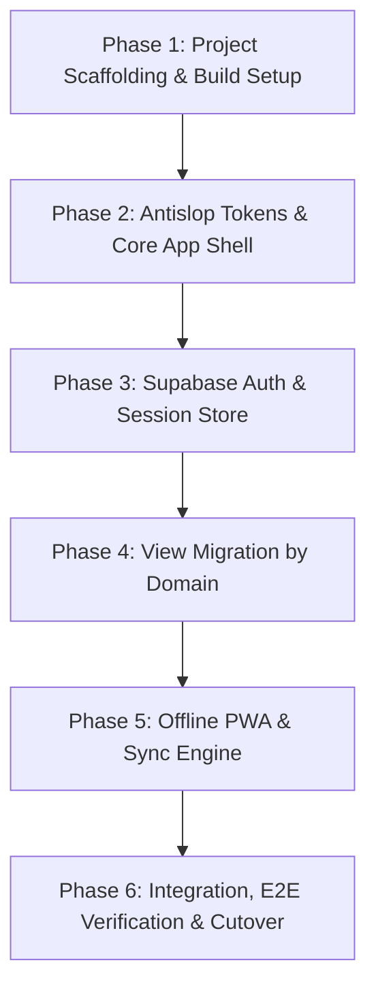

# MFC Youth Area Management System (MFC Youth AMS)
## Frontend Modernization & Migration Plan (Vanilla HTML -> Vite + React + TypeScript)

> **Audience**: AI Coding Agents (Claude / Claude Code / Codex) & Lead Engineers.  
> **Status**: Completed (All 6 Phases Executed & Verified).  
> **Antislop Mode**: Active and passed Delivery Gate.

---

## 1. System & Operational Context

The **MFC Youth Area Management System (MFC Youth AMS)** is a secure, field-ready administrative and pastoral portal for **Missionary Families for Christ (MFC) Youth**.

### Operating Environment & Persona Constraints
- **Primary Users**: Servant Leaders, Chapter Heads, and Household Leaders operating in parish halls, retreat camps, classrooms, and outdoor event grounds on smartphones under spotty or offline mobile network conditions.
- **Secondary Users**: Area Coordinators and Admins requiring aggregate pastoral oversight across chapters and ministries on desktop workstations.
- **Core Principles** (from `PRODUCT.md`):
  1. **Servant-First Efficiency**: Rapid mobile workflows, minimal taps, clear feedback, zero visual friction.
  2. **Reverent Utility**: High-contrast, clean typography, calm layout over decorative fluff or gimmicks.
  3. **Pastoral Trust & Data Privacy**: Strict protection of minor contact and emergency details (ages 13–21).
  4. **Offline Resilience**: Offline-first caching for attendance and reference data during venue network dropouts.

---

## 2. Mandatory Antislop & UI Guidelines

All code generated during this migration must comply with the project antislop rules:

### Visual & Palette Rules (`antislop-ui`)
- **Primary Brand Colors**:
  - Deep Community Navy: `#002847` (Brand dominant, navigation, strong headers)
  - Crisp Off-White Base: `#F4F7FB` (Background surface)
  - Pure White: `#FFFFFF` (Card/sheet elevated surfaces)
  - Text Navy / Charcoal: `#0F172A` (Body text for high legibility)
  - Muted Slate: `#64748B` (Secondary text, metadata)
  - Status Accents: Muted Green (`#15803D`), Amber (`#B45309`), Crimson (`#B91C1C`)
- **BANNED Patterns**:
  - **NO** generic AI blue-to-purple / cyan-to-purple gradients.
  - **NO** excessive glassmorphism (`backdrop-blur` on everything). Glass is capped at 1 surface maximum (e.g. fixed header only).
  - **NO** universal pill shapes (`rounded-full` everywhere). Use deliberate radius tokens (`rounded-lg` for cards/inputs, `rounded-md` for buttons).
  - **NO** glow effects (`box-shadow` or neon borders). Keep cards and surfaces grounded and matte.
  - **NO** generic bento grid templates or meaningless decorative card spam.

### Mobile & Ergonomics Rules (`antislop-layoutmobile`)
- **Reflow, Don't Just Shrink**: Mobile is a distinct layout state, not a shrunken desktop view.
- **Tap Targets**: Minimum `44px` height/width on all touchable elements (buttons, inputs, dropdown items, list rows).
- **Navigation**:
  - Desktop: Collapsible sidebar navigation.
  - Mobile: Fixed top header + bottom navigation bar for high-frequency servant actions (Dashboard, Members, Events, Check-in).
- **Forms**: Single-column vertical stacking with large touch-friendly inputs, avoiding horizontal multi-column form fields on screens narrower than `768px`.

### Code Hygiene (`antislop-code`)
- **NO generic AI comments** (e.g. `// Function to handle click`, `// State for loading`).
- Self-documenting TypeScript interfaces and clean naming.
- Retain non-obvious domain docstrings and architectural explanations only.

---

## 3. Target Technology Stack

| Layer | Selection | Justification |
| :--- | :--- | :--- |
| **Bundler & Tooling** | Vite 6 | Instant HMR, static bundle output, low config overhead |
| **UI Library** | React 19 + TypeScript | Component modularity, strict typing, broad ecosystem |
| **Styling** | Tailwind CSS v4 / v3.4 | Utility-driven, zero runtime CSS, enforce token palette |
| **Icons** | Lucide React | Lightweight, consistent 24px icon set |
| **UI Primitives** | Radix UI (`@radix-ui/react-*`) | Unstyled, accessible (WAI-ARIA compliant) headless primitives |
| **Routing** | React Router v7 (or v6) | Declarative layout routes, protected route guards |
| **Server State** | TanStack Query v5 | Built-in caching, background refetch, offline query persistence |
| **Client State** | Zustand | Lightweight session & filter store (active area, chapter) |
| **Offline / PWA** | `vite-plugin-pwa` + Workbox | Reliable offline asset caching and service worker lifecycle |
| **Backend Integration** | Existing Express Server (`server.js`) + Supabase JS | Zero disruption to `/api/*` endpoints in `Backend/api/router.js` |

---

## 4. Migration Architecture & Phased Roadmap



---

### Phase 1: Project Scaffolding & Build Setup
**Goal**: Set up Vite + React + TypeScript inside the repository without breaking the existing Express server.

1. **Workspace / Directory Strategy**:
   - Create the modern React codebase in `frontend-modern/` (or directly inside `Frontend/src` alongside legacy files while building).
   - Configure Vite build target to output to `Frontend/dist` (or compile into `Frontend/`).
2. **Vite Configuration (`vite.config.ts`)**:
   - Proxy `/api` to `http://localhost:3000` during development so frontend dev server talks directly to the Express backend.
   - Configure path aliases (`@/*` -> `./src/*`).
3. **Tailwind & PostCSS Setup**:
   - Configure Tailwind with MFC Youth colors:
     ```js
     theme: {
       extend: {
         colors: {
           navy: { DEFAULT: '#002847', light: '#003a66', dark: '#001a30' },
           canvas: '#F4F7FB',
         }
       }
     }
     ```
4. **Server Compatibility**:
   - Update `server.js` static middleware: if `Frontend/dist/index.html` exists, serve from `Frontend/dist/` and route non-API paths to `index.html` (SPA fallback).

---

### Phase 2: Design System & Antislop Layout Shell
**Goal**: Build reusable, accessible UI components and the unified App Shell.

1. **Atomic Components (`src/components/ui/`)**:
   - `Button`: Primary (Navy solid), Secondary (Slate outline), Danger (Crimson), Ghost. Min height 44px on mobile.
   - `Input`, `Select`, `Checkbox`, `Textarea`: High contrast border, explicit focus rings (`ring-2 ring-navy/20`).
   - `Badge`: Status tags (Active, Pending, Paid, Checked-in) with legible foreground/background contrast.
   - `ModalDialog` / `Sheet`: Bottom sheet on mobile, centered modal on desktop.
   - `Toast`: Minimalist feedback banners (success, error, offline alert).
2. **Application Layout (`src/components/layout/`)**:
   - `AppLayout`:
     - **Header**: MFC Youth Logo, Area Selector dropdown, User Profile avatar & status.
     - **Desktop Sidebar**: Dashboard, Members, Chapters, Events, Services, GIG, Reports.
     - **Mobile Bottom Navigation**: 4-5 core quick items (Dashboard, Members, Events, Profile) with 48px tap targets.
     - **Offline Indicator Banner**: Unintrusive strip alerting user when offline.

---

### Phase 3: Auth & Session Management
**Goal**: Migrate all authentication and security flows.

1. **Supabase Client & Auth Provider (`src/context/AuthContext.tsx`)**:
   - Supabase client initialization via environment variables (`VITE_SUPABASE_URL`, `VITE_SUPABASE_ANON_KEY`).
   - Listen to `supabase.auth.onAuthStateChange`.
   - Store profile state (role: Admin, Area Head, Chapter Head, Servant, Member).
2. **Auth Routes (`src/pages/auth/`)**:
   - `/login` (Servant login & Member login tabs)
   - `/register` (Servant passcode verification & onboarding)
   - `/forgot-password`, `/reset-password`, `/change-password`
   - `/mfa-setup`, `/mfa-verify` (TOTP MFA flows mapped to `/api/auth/mfa/*`)
3. **Protected Route Guards**:
   - `<ProtectedRoute requiredRole="..." />` redirecting unauthenticated users to `/login`.

---

### Phase 4: Feature View Migration (Iterative)
**Goal**: Convert legacy HTML pages into typed, reactive components.

#### 4.1 Dashboard (`src/pages/dashboard/`)
- Legacy: `dashboard.html`
- Features:
  - Metric cards (Total Active Members, Upcoming Events, Attendance Rate, Household Health).
  - Quick Action Buttons (Add Member, Check-in, Log Household).
  - Recent Area Activity feed.

#### 4.2 Members Directory (`src/pages/members/`)
- Legacy: `members.html`, `member.html`
- Features:
  - Member table / list with search, chapter filter, household filter, age range filter (13–21).
  - Member Detail Drawer / Page:
    - Pastoral details, sacraments, household leader.
    - Privacy masking: Mask emergency contact phone numbers for unauthorized viewers.
  - Member Create / Edit Modal with field validations.

#### 4.3 Chapters & Households (`src/pages/chapters/`)
- Legacy: `chapters.html`
- Features:
  - Chapter hierarchy cards.
  - Member assignment manager (replaces `chapterAssignMembers`).
  - Household leader roster.

#### 4.4 Events & Attendance (`src/pages/events/`)
- Legacy: `events.html`
- Features:
  - Event list (Upcoming, Completed, Retreats, Assemblies).
  - Event Detail & Registration Tracker: Fee paid status, participant counts.
  - **Field Attendance Scanner / Check-in**:
    - Rapid one-tap member check-in.
    - Offline queueing: writes to local IndexedDB store if camp Wi-Fi drops, synced when connection returns.

#### 4.5 Stewardship & Ministry Services (`src/pages/services/`, `src/pages/gig/`)
- Legacy: `services.html`, `gig.html`
- Features:
  - Ministry Service catalog (Music, LIT, Logistics, Tech, Camp Servants).
  - GIG (God Is Generous) stewardship & tithe records.

#### 4.6 Reports & Utilities
- Legacy: `reports.html`, `readings.html`, `changelogs.html`
- Features:
  - Area Monthly Activity Report generator & CSV/PDF exporter.
  - Daily Catholic Gospel / scripture readings view (via `/api/daily-readings`).
  - System version changelog drawer.

---

### Phase 5: Offline PWA & Sync Engine
**Goal**: Match and exceed legacy Service Worker capabilities.

1. **Vite PWA Plugin Configuration**:
   - Replace manual `sw.js` with `vite-plugin-pwa` generating Workbox service worker.
   - Cache manifest (`manifest.webmanifest`) with icons and maskable assets.
2. **Offline Data Sync (`src/lib/offline/`)**:
   - Modernize `offline-store.js` and `sync-manager.js` into typed IndexedDB repositories.
   - TanStack Query mutation offline queue:
     - When offline, attendance check-in requests are queued locally.
     - On window `online` event, sync worker flushes mutations to `/api/sync` or `/api/participants`.

---

### Phase 6: Verification, Health Checks & Safe Cutover
**Goal**: Verify reliability, run existing test suites, and switch traffic safely.

1. **Syntax & Health Check Verification**:
   - Run `npm run test:syntax`.
   - Run `npm run test:health`.
2. **Build Verification**:
   - Run `npm run build` to verify type-checking and bundle compilation with 0 errors.
3. **Visual & Responsive Antislop Audit**:
   - Test viewport at 375px (iPhone SE/narrow mobile), 768px (iPad/tablet), and 1440px (desktop).
   - Ensure tap targets >= 44px, no horizontal scroll clipping, high-contrast readability.
4. **Decommissioning Legacy Files**:
   - Archive legacy HTML files cleanly into `legacy-html/` or delete once all routes are verified in Git.

---

## 5. Checklist for Claude / Executing Agent

- [x] Respect existing backend APIs in `Backend/api/router.js` without altering API contracts.
- [x] Enforce `#002847` Navy and `#F4F7FB` Off-White palette without AI gradient slop.
- [x] Ensure all touch targets on mobile meet or exceed `44px`.
- [x] Write typed TypeScript code without using `any`.
- [x] Maintain minor privacy protections on member contact info.
- [x] Verify that `npm run test:syntax` and `npm run test:health` pass at every stage.
