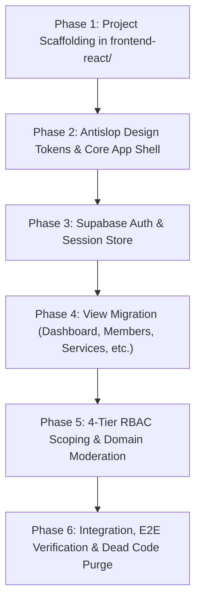

# MFC Youth Area Management System (MFC Youth AMS)
## Frontend Modernization & Migration Plan (Static HTML to Vite + React 19 + TypeScript)

> **Audience**: Engineering Team and Contributors  
> **Status**: Completed (All 6 Phases Executed, Migrated, and Verified)  
> **Antislop Mode**: Active and strictly validated

---

## 1. System & Operational Context

The **MFC Youth Area Management System (MFC Youth AMS)** is a secure, field-ready administrative and pastoral portal for **Missionary Families for Christ (MFC) Youth**.

### Operating Environment & Persona Constraints
- **Primary Users**: Servant Leaders, Chapter Heads, and Household Leaders operating in parish halls, retreat camps, classrooms, and outdoor event grounds on smartphones under spotty or offline mobile network conditions.
- **Secondary Users**: Area Coordinators, Domain Moderators, and Admins requiring aggregate pastoral oversight across chapters and ministries on desktop workstations.
- **Core Principles** (from `PRODUCT.md`):
  1. **Servant-First Efficiency**: Rapid mobile workflows, minimal taps, clear feedback, zero visual friction.
  2. **Reverent Utility**: High contrast, clean typography, calm layout over decorative fluff or gimmicks.
  3. **Pastoral Trust & Data Privacy**: Strict protection of minor contact and emergency details (ages 13 to 21).
  4. **Offline Resilience**: Reliable caching for attendance and reference data during venue network dropouts.

---

## 2. Mandatory Antislop & UI Guidelines

All frontend implementation follows these design rules:

### Visual & Palette Rules (`antislop-ui`)
- **Primary Brand Colors**:
  - Deep Community Navy: `#002847` (Brand dominant, navigation, strong headers)
  - Crisp Off-White Base: `#F8FAFC` (Background surface)
  - Pure White: `#FFFFFF` (Card and sheet elevated surfaces)
  - Text Navy / Charcoal: `#0F172A` (Body text for high legibility)
  - Muted Slate: `#64748B` (Secondary text, metadata)
  - Status Accents: Muted Green (`#15803D`), Amber (`#B45309`), Crimson (`#B91C1C`)
- **Prohibited Patterns**:
  - No generic AI blue-to-purple or cyan-to-purple gradients.
  - No excessive glassmorphism. Glass is capped at 1 surface maximum (fixed header only).
  - No universal pill shapes (`rounded-full` everywhere). Use deliberate radius tokens (`rounded-lg` for cards/inputs, `rounded-md` for buttons).
  - No neon glow effects. Keep cards and surfaces grounded and matte.
  - No generic bento grid templates or meaningless decorative card spam.

### Mobile & Ergonomics Rules (`antislop-layoutmobile`)
- **Reflow, Don't Just Shrink**: Mobile is a distinct layout state, not a shrunken desktop view.
- **Tap Targets**: Minimum 44px height and width on all touchable elements (buttons, inputs, dropdown items, list rows).
- **Navigation**:
  - Desktop: Collapsible sidebar navigation.
  - Mobile: Fixed top header plus bottom navigation bar for high-frequency servant actions (Dashboard, Members, Chapters, Services, Events, Reports).
- **Forms**: Single-column vertical stacking with large touch-friendly inputs, avoiding horizontal multi-column form fields on narrow mobile screens.

### Code Hygiene (`antislop-code`)
- No generic AI comments.
- Self-documenting TypeScript interfaces and clean naming.
- Retain non-obvious domain docstrings and architectural explanations only.

---

## 3. Technology Stack

| Layer | Selection | Justification |
| :--- | :--- | :--- |
| **Bundler & Tooling** | Vite 6 | Instant HMR, static bundle output, low config overhead |
| **UI Library** | React 19 + TypeScript | Component modularity, strict typing, broad ecosystem |
| **Styling** | Tailwind CSS v4 | Utility-driven, zero runtime CSS, enforce token palette |
| **Icons** | Lucide React | Lightweight, consistent 24px icon set |
| **Routing** | React Router v7 | Declarative layout routes, protected route guards |
| **Client State** | Zustand | Lightweight session and filter store (auth, active area, chapter) |
| **Backend Integration** | Serverless Node.js 24 API | Direct proxy to `Backend/api/router.js` with 100% contract parity |

---

## 4. Completed Execution Phases

### Phase 1: Project Scaffolding
- Initialized React 19 + TypeScript + Vite in `frontend-react/`.
- Configured Vite proxy to route `/api/*` to backend dev server on port 3000.
- Set up Tailwind CSS with official MFC Youth color palette.

### Phase 2: Core App Shell & Mobile Ergonomics
- Implemented persistent Header with servant profile information and quick logout.
- Built responsive Sidebar for desktop and bottom tab navigation for mobile devices.
- Added touch-friendly card wrappers with 44px tap targets.

### Phase 3: Authentication & State Management
- Built `authStore` via Zustand to handle session persistence, active area, and profile caching.
- Created `LoginPage`, `RegisterPage`, `ForgotPasswordPage`, and `ChangePasswordPage`.
- Added authentication route guards (`ProtectedRoute`) that redirect unauthenticated traffic to `/login`.

### Phase 4: View Migration from Static HTML
- **Dashboard**: Live metric cards, mission shortcuts, recent registrations, and Catholic Daily Scripture card.
- **Members**: Complete youth directory, academic track filtering (College, SHS, High School, Heartchamp), search, profile editor, and status toggles.
- **Chapters**: Chapter list, member counts, chapter servant assignments, and household groupings.
- **Services**: The 5 Creative Ministries (Music, Dance, Graphics & Promo, Creative Writing, Photography & Videography). Purged legacy unmentioned services.
- **Events**: Activity schedule, attendance counter, registration tracking, and fee status.
- **Reports**: Activity report logs, participant totals, and printable documentation.
- **GIG (Give It Generously)**: Tithes and stewardship contribution tracking.

### Phase 5: 4-Tier RBAC & Domain Moderation
- Implemented backend scoping in `Backend/server/_lib/access.js`, `members/index.js`, and `sync/index.js`.
- Restricted `lit_servant` to the 5 Creative Ministries.
- Restricted `campus_servant` to College and SHS youth.
- Restricted `mfc_high_servant` to Junior High School youth (Grades 7 to 10).
- Restricted `area_kids_servant` to Heartchamps.
- Applied live database Row Level Security policy migration `016_domain_moderator_rls_scoping.sql`.

### Phase 6: Dead Code Purge & Verification
- Removed all legacy static HTML views (`Frontend/` directory and root `.html` files).
- Verified TypeScript build: `tsc -b && vite build` passing with zero errors.
- Verified backend syntax: `npm run test:syntax` passing with zero errors.
- Verified backend health endpoint: `npm run test:health` returning HTTP 200.
